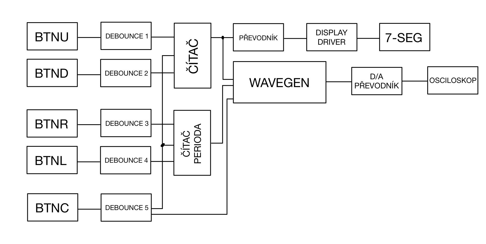

# Tri-Saw-Square Generator 5000 OMAMA
Our function generator has following functions:
1. Ability to generate 3 different waveforms
    - sawtooth
    - triangle
    - square

2. Ability to generate signals of 4 different frequencies.

The output is routed to Pmod headers and converted to analog voltages using external DAC.

## Block diagram

