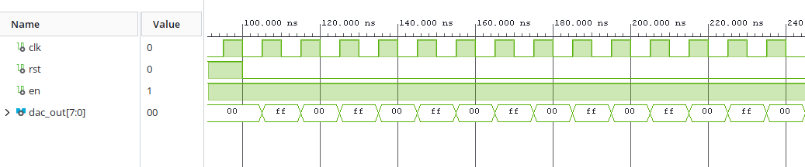
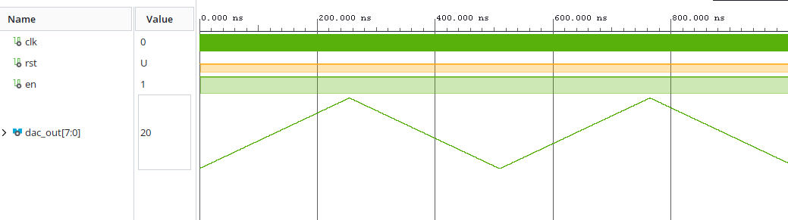
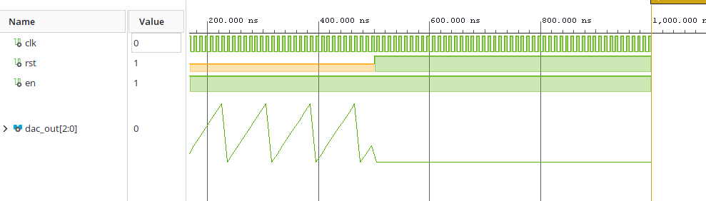
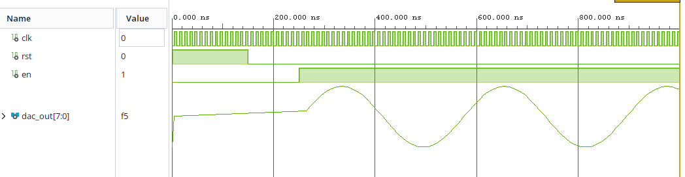
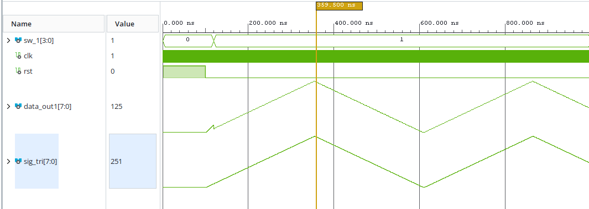

# FPGA function generator
### Our function generator has following functions:
1. #### Ability to generate 4 different waveforms
    - sawtooth
    - triangle
    - square
    - sin

2. #### Ability to generate signals of 4 different frequencies.

3. #### Ability to select output amplitude

3. #### Push buttons on Nexys A7 50T board are used to control the generator:
    - Center button is wired to reset
    - Left and right buttons change between available frequencies
    - Up and down buttons change between available signals

The output is routed to Pmod headers and converted to analog voltages using external R-2R ladder DAC.

## Block diagram

## New components
### 1. Bidirectional counter
Bidirectional counter is a synchronous counter with configurable length.

#### Generics
- **G_BITS**: counter length in bits

#### Inputs
- **clk**: 100 MHz clock
- **up**: Count up if high
- **down**: Count down if high
- **rst**: Reset to zero if high
- **en**: Enable

#### Outputs
- **cnt**: Counter value

#### Simulation

### 2. Multiplexer
Multiplexer is just that. A simple 4 to 1 multiplexer. It takes in an input vector that selects which input is routed to its output.

#### Generics
- **G_LENGTH**: Selects the length of vectors that will be multiplexed

#### Inputs
- **a**: First input
- **b**: Second input
- **c**: Third input
- **d**: Fourth input
- **sel**: 2 bit control signal

#### Outputs
- **output**: Mux output

#### Simulation

### 3. sig_name_encoder
This block generates a 56 bit long vector with data for 7 segment displays. Each output bit coresponds to one segment of 8 available 7 segment displays. It looks at current selected signal and period and outputs the name of the selected signal and selected period to be displayed by display_driver_direct_data.

#### Inputs
- **cnt_sig**: Data from signal select counter
- **cnt_per**: Data from period select counter

#### Outputs
- **data**: 56 bit output vector

#### Simulation

### 4. display_driver_direct_data
This is a display driver block that works on a similar principle as display_driver writen on computer excercises. It was modified to take a 56 bit long input vector where each bit coresponds to 1 segment of all 8 seven segment displays. This allows us light up arbitrary segments, which is useful, because we need to display a lot of different letters that are not available in the original display_driver.

#### Inputs
- **clk**: 100 MHz clock
- **rst**: Active high reset
- **data**: 56 bit long input vector

#### Outputs
- **seg**: 7 bit long vector with data for individual 7 segment displays
- **anode**: 8 bit long vector with only one bit low at a time, selecting 1 seven segment display at a time

### 5. gen_sqr
This block generates a square wave. It alternates between 2 states, all zeros and all ones.

#### Inputs
- **clk**: 100 MHz clock
- **rst**: Active high reset
- **en**: Active high enable

#### Outputs
- **dac_out**: 8 bit long output vector for DA subsequent conversion

Simulation does not show an analog waveform, because vivado would just connect individual points, making it look like a triangular waveform instead of a square one.

### 6. gen_tri
This block generates a triangular wave. It has an internal bidirectional 8 bit counter that starts counting up and once it reaches 255 direction flips and it starts counting down. At 0 it flips again.

#### Inputs
- **clk**: 100 MHz clock
- **rst**: Active high reset
- **en**: Active high enable

#### Outputs
- **dac_out**: 8 bit long output vector for DA subsequent conversion

### 7. gen_saw
This is not a new block, but we wanted to have all waveforms simulated. Gen_saw is a simple up counter.

#### Inputs
- **clk**: 100 MHz clock
- **rst**: Active high reset
- **en**: Active high enable

#### Outputs
- **dac_out**: 8 bit long output vector for DA subsequent conversion

### 8. gen_sin
This block generates a sinusoidal wave. This is the only code that was not written by us, because we didn't really know how to approach this. So instead we found this code (waiting for a link) and modified it slightly to work with out setup.

#### Inputs
- **clk**: 100 MHz clock
- **rst**: Active high reset
- **en**: Active high enable

#### Outputs
- **dac_out**: 8 bit long output vector for DA subsequent conversion

### 9. ampl_ch
This block allows for changing output amplitude. It simply divides the 8 bit output signal by bitshifting it to the right by 1, 2 or 3 bits based on a current value comming from switches on the board.

#### Inputs
- **sw**: 2 bit vector, current value on switches
- **data_in**: 8 bit vector, input data to be devided

#### Outputs
- **data_out**: 8 bit vector, devided data

It is not immediately obvious, since vivado shows both waveforms as having the same amplitude, but the top waveform is devided by 2. This can be verified by looking at current value at the cursor.