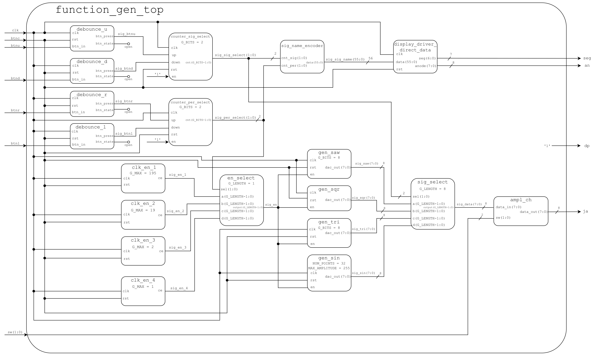
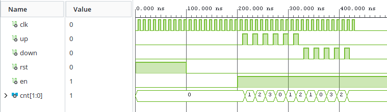
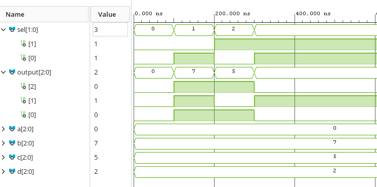
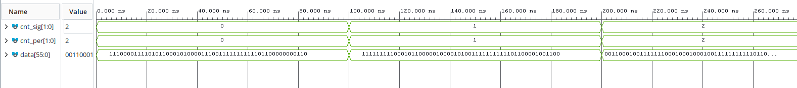
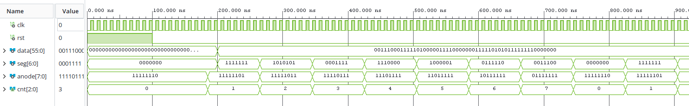

# FPGA function generator
### Our function generator has following functions:
1. #### Ability to generate 4 different waveforms
    - sawtooth
    - triangle
    - square
    - sin

2. #### Ability to generate signals of 4 different frequencies.

3. #### Ability to select output amplitude

3. #### Push buttons on Nexys A7 50T board are used to control the generator:
    - Center button is wired to reset
    - Left and right buttons change between available frequencies
    - Up and down buttons change between available signals

The output is routed to Pmod headers and converted to analog voltages using external R-2R ladder DAC.

## Block diagram

## New components
### 1. Bidirectional counter
Bidirectional counter is a synchronous counter with configurable length.

#### Generics
- **G_BITS**: counter length in bits

#### Inputs
- **clk**: 100 MHz clock
- **up**: Count up if high
- **down**: Count down if high
- **rst**: Reset to zero if high
- **en**: Enable

#### Outputs
- **cnt**: Counter value

#### Simulation

### 2. Multiplexer
Multiplexer is just that. A simple 4 to 1 multiplexer. It takes in an input vector that selects which input is routed to its output.

#### Generics
- **G_LENGTH**: Selects the length of vectors that will be multiplexed

#### Inputs
- **a**: First input
- **b**: Second input
- **c**: Third input
- **d**: Fourth input
- **sel**: 2 bit control signal

#### Outputs
- **output**: Mux output

#### Simulation

### 3. sig_name_encoder
This block generates a 56 bit long vector with data for 7 segment displays. Each output bit coresponds to one segment of 8 available 7 segment displays. It looks at current selected signal and period and outputs the name of the selected signal and selected period to be displayed by display_driver_direct_data.

#### Inputs
- **cnt_sig**: Data from signal select counter
- **cnt_per**: Data from period select counter

#### Outputs
- **data**: 56 bit output vector

#### Simulation

### 4. display_driver_direct_data
This is a display driver block that works on a similar principle as display_driver writen on computer excercises. It was modified to take a 56 bit long input vector where each bit coresponds to 1 segment of all 8 seven segment displays. This allows us light up arbitrary segments, which is useful, because we need to display a lot of different letters that are not available in the original display_driver.

#### Inputs
- **clk**: 100 MHz clock
- **rst**: Active high reset
- **data**: 56 bit long input vector

#### Outputs
- **seg**: 7 bit long vector with data for individual 7 segment displays
- **anode**: 8 bit long vector with only one bit low at a time, selecting 1 seven segment display at a time

